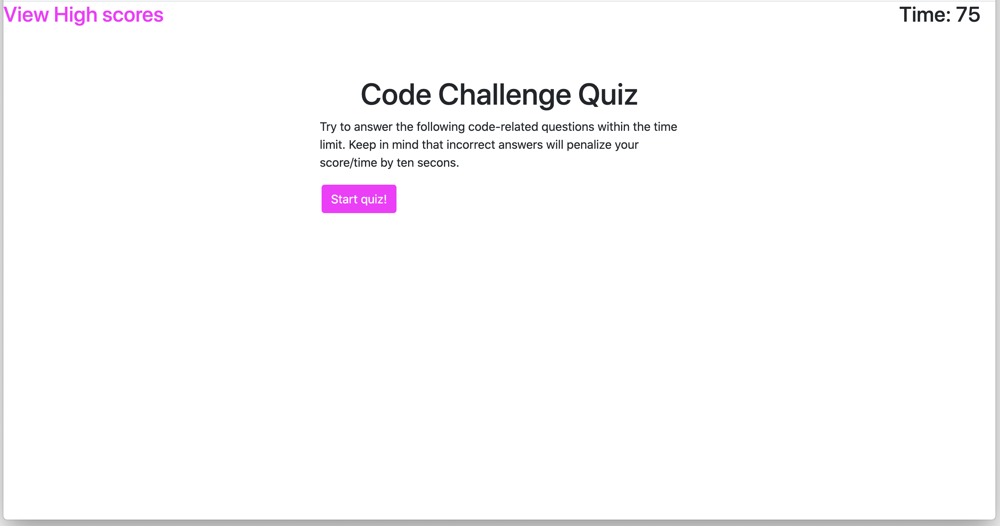

#Coding Quiz

## Description

This site features a quiz about various aspects of coding. 

## Installation
    
1. pull repo to local machine
2. open index.html

## Usage

[Deployed Site](https://roblingjohn.github.io/gt-homework-03-passwordgen/)

After clicking the start button, the user has 75 seconds to answer the five question. An incorrect answer results in ten seconds being reduced from the time. At the conclusion of the quiz, the user's score is equivalent to their time remaining. After entering their initials, a high score screen is seen featuring the scores of previous attempts, stored in local storage. This screen can also be accessed from the main screen by clicking the text in the top left corner.

## Credits

This page was designed and scripted by John Robling. CSS provided by Bootstrap (http://getbootstrap.com).